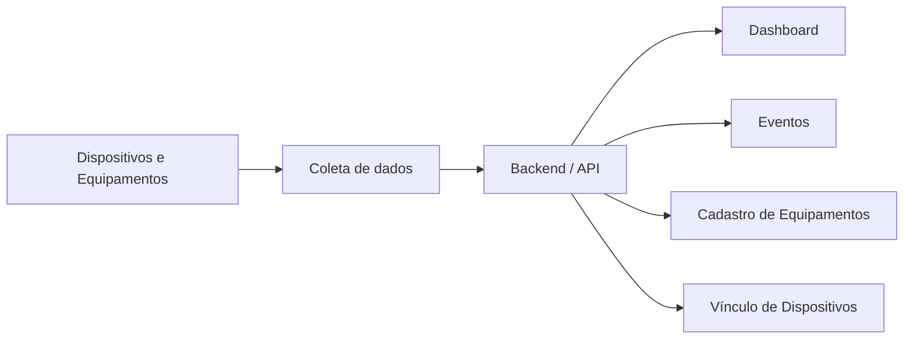

# Dashboard — Monitoramento de Equipamentos de Engenharia Clínica

## Descrição do projeto
Este projeto tem como objetivo criar um dashboard web para monitoramento contínuo de equipamentos médico-hospitalares a partir de dispositivos IoT baseados em ESP32.

Cada dispositivo físico, composto por um botão e LEDs de sinalização, será vinculado a um equipamento específico do parque tecnológico hospitalar. Ao interagir com o botão, o dispositivo enviará eventos em formato JSON para o backend do sistema, permitindo o acompanhamento remoto do estado operacional dos equipamentos.

O sistema foi pensado para apoiar a Engenharia Clínica no controle do parque tecnológico, facilitando a visualização de equipamentos funcionais, em necessidade de manutenção ou indisponíveis, além do monitoramento da conectividade dos dispositivos instalados.

---

## Objetivos
O dashboard deverá permitir:

- cadastrar equipamentos
- armazenar nome, código, patrimônio, setor e descrição
- vincular cada dispositivo IoT a um equipamento específico
- receber eventos JSON enviados pelos dispositivos
- atualizar continuamente o status dos equipamentos
- monitorar conectividade online/offline por heartbeat
- manter histórico de eventos para rastreabilidade

---

## Estrutura inicial do projeto
A estrutura principal do projeto será organizada da seguinte forma:

```text
CareNode/
├── frontend/
│   ├── src/
│   │   ├── components/
│   │   │   ├── dashboard/
│   │   │   ├── equipamentos/
│   │   │   └── layout/
│   │   ├── hooks/
│   │   ├── pages/
│   │   ├── styles/
│   │   └── utils/
│   └── ...
├── backend/
│   └── ...
└── README.md

---
```

## Como executar

### Backend

```bash
cd backend
npm install
npm start
```

### Frontend

```bash
cd frontend
npm install
npm run dev
```

### Testes do backend

```bash
cd backend
npm install
npm test
```
## Tecnologias utilizadas

Este projeto pode incluir tecnologias como:

- **React**
- **JavaScript**
- **CSS**
- **Node.js**
- **API REST**


## Principais módulos

### Dashboard

Apresenta uma visão consolidada das informações mais importantes do sistema, facilitando o acompanhamento do estado geral dos equipamentos.

### Equipamentos

Responsável pelo cadastro, edição, listagem e filtragem dos equipamentos monitorados.

### Eventos

Permite registrar, consultar e acompanhar ocorrências relacionadas aos dispositivos e ativos do sistema.

### Vínculo de dispositivos

Gerencia a associação entre equipamentos físicos e seus respectivos dispositivos conectados.

## Objetivo

O **CareNode** tem como objetivo fornecer uma solução prática e organizada para o gerenciamento de equipamentos e dispositivos, promovendo:

- maior visibilidade operacional;
- melhor rastreabilidade de eventos;
- apoio à tomada de decisão;
- otimização do acompanhamento técnico dos ativos.

## Fluxo geral do sistema


## Como executar o projeto

### Pré-requisitos

Antes de começar, você vai precisar ter instalado em sua máquina:

- **Node.js**
- **npm ou yarn**

### Instalação

Clone o repositório:

```bash
git clone https://github.com/seu-usuario/carenode.git
```
```bash
cd carenode
```
```bash
cd frontend
npm install
```
```bash
cd ../backend
npm install
```
## Execução

### Frontend

```bash
cd frontend
npm run dev
```
Ou, dependendo da configuração:
```bash
npm start
```
###Backend
```bash
cd backend
npm run dev
```
Ou:
```bash
npm start
```
## Interface esperada

O sistema foi pensado para oferecer uma navegação simples e clara, com páginas dedicadas para:

- dashboard principal;
- gerenciamento de equipamentos;
- visualização de eventos;
- formulários de cadastro e vínculo;
- componentes de layout para organização da interface.

## Aplicações possíveis

O **CareNode** pode ser aplicado em diferentes contextos, como:

- engenharia clínica hospitalar;
- monitoramento de dispositivos conectados;
- gestão de ativos tecnológicos;
- acompanhamento de infraestrutura técnica.

